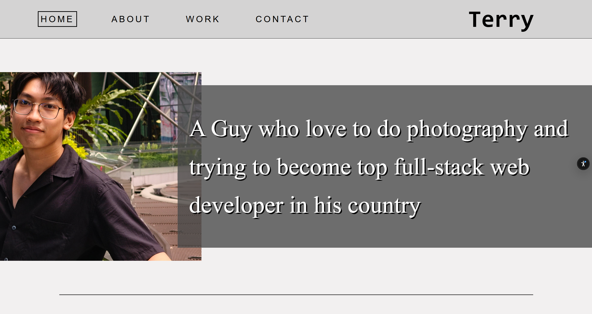

# 🌐 Web Development Assignment

### 🔗 [Live Demo on Vercel](https://portfolio-assignment-beryl.vercel.app/)

---

## 📝 Project Overview
This project was developed as part of the Web Development module at Goldsmiths. It demonstrates front-end capabilities, focusing on responsive design.

## 🚀 Features
- **Responsive UI:** Fully optimized for mobile, tablet, and your Legion 5 Pro display.
- **Clean Architecture:** Organized code following modern web standards.

## 🛠️ Tech Stack
- **Frontend:** HTML5, CSS3, JavaScript (ES6+)
- **Deployment:** Vercel (CI/CD via GitHub)

## 📸 Preview
 

---

## 🛠️ Local Setup
To run this project locally:
1. Clone the repository in VS code.
2. Install 'Live Server' extension.
3. Click on 'Go Live'
